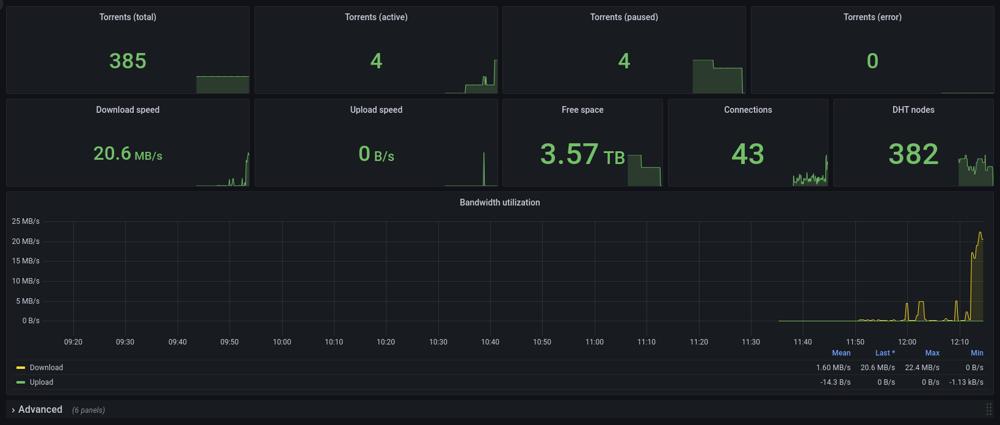
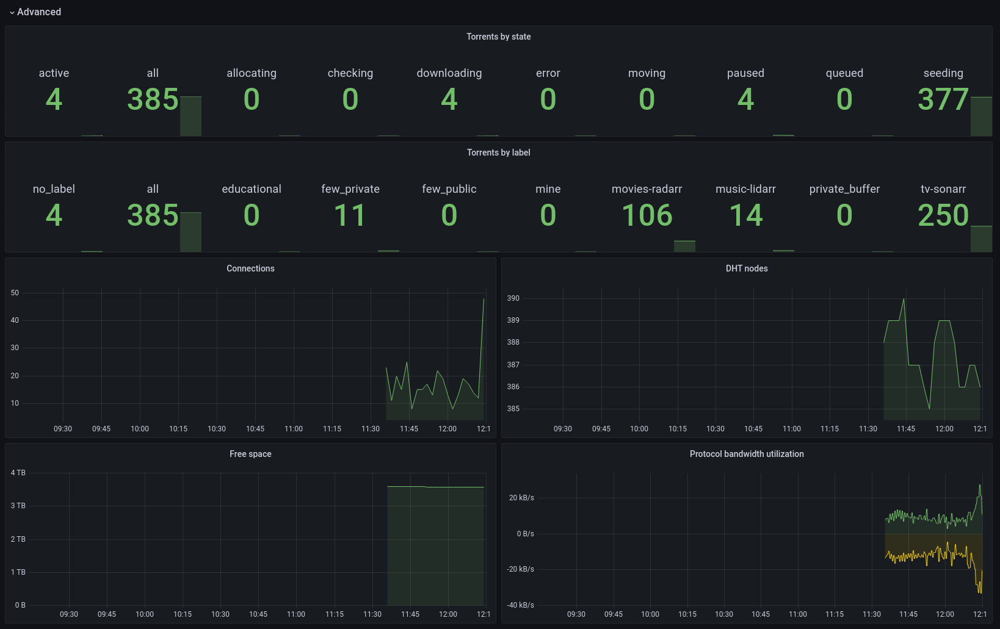

# ngosang/deluge-exporter

[](https://github.com/ngosang/deluge-exporter/releases)
[](https://hub.docker.com/r/ngosang/deluge-exporter/)
[](https://www.paypal.com/paypalme/diegoheras0xff)
[](https://www.blockchain.com/btc/address/14EcPN47rWXkmFvjfohJx2rQxxoeBRJhej)
[](https://www.blockchain.com/eth/address/0x0D1549BbB00926BF3D92c1A8A58695e982f1BE2E)

Prometheus exporter for the [Deluge](https://deluge-torrent.org/) Bittorrent client. It is designed to use the [Deluge Web API](https://deluge.readthedocs.io/en/latest/reference/webapi.html) and to be lightweight. Tested with Deluge 2.1.

There are other Deluge exporters, like [tobbez/deluge_exporter](https://github.com/tobbez/deluge_exporter), which exposes more metrics, but I experienced reliability and performance issues. The reason is all of them use the [deluge-client](https://github.com/JohnDoee/deluge-client) for Python. That library uses the [Deluge RPC API](https://deluge.readthedocs.io/en/latest/reference/rpc.html) which is more complete than the Web API, but it is dependant on the Deluge version, has [inappropriate reconnection logic](https://github.com/tobbez/deluge_exporter/issues/23), and it uses more resources.

## Install

### Form source code

Requirements:
 * Python 3
 * [prometheus-client](https://github.com/prometheus/client_python)
 * [requests](https://docs.python-requests.org/en/latest/index.html)

```bash
pip install -r /requirements.txt

export DELUGE_URL=http://192.168.1.191:8112
export DELUGE_PASSWORD=<password_here>
python deluge-exporter.py
```

### Docker

Docker images are available in [GHCR](https://github.com/ngosang/deluge-exporter/pkgs/container/deluge-exporter) and [DockerHub](https://hub.docker.com/r/ngosang/deluge-exporter).

```bash
docker pull ghcr.io/ngosang/deluge-exporter
or
docker pull ngosang/deluge-exporter
```

#### Supported Architectures

The architectures supported by this image are:

* linux/386
* linux/amd64
* linux/arm/v6
* linux/arm/v7
* linux/arm64/v8
* linux/ppc64le
* linux/s390x

#### docker-compose

Compatible with docker-compose v2 schemas:

```yaml
---
version: '2.1'
services:
  deluge-exporter:
    image: ngosang/deluge-exporter
    container_name: deluge-exporter
    environment:
      - TZ=Europe/Madrid
      - DELUGE_URL=http://192.168.1.191:8112
      - DELUGE_PASSWORD=<password_here>
      - LOG_LEVEL=INFO
    ports:
      - "8011:8011"
    restart: unless-stopped
```

#### docker cli

```bash
docker run -d \
  --name=deluge-exporter \
  -e TZ=Europe/Madrid \
  -e DELUGE_URL=http://192.168.1.191:8112 \
  -e DELUGE_PASSWORD=<password_here> \
  -e LOG_LEVEL=INFO \
  -p 8011:8011 \
  --restart unless-stopped \
  ngosang/deluge-exporter
```

## Configuration

All configuration is done with environment variables.

- `DELUGE_URL`: Deluge Web UI URL. Example: `http://192.168.1.191:8112`.
- `DELUGE_PASSWORD`: Deluge Web UI password in plain text.
- `LISTEN_PORT`: (Optional) The address the exporter should listen on. The default is `8011`.
- `LISTEN_ADDRESS`: (Optional) The address the exporter should listen on. The default is to listen on all addresses.
- `LOG_LEVEL`: (Optional) Log level of the traces. The default is `INFO`.

## Exported metrics

```shell
# HELP deluge_torrent_state_count Number of torrents by state
# TYPE deluge_torrent_state_count gauge
deluge_torrent_state_count{state="all"} 18.0
deluge_torrent_state_count{state="active"} 0.0
deluge_torrent_state_count{state="allocating"} 0.0
deluge_torrent_state_count{state="checking"} 0.0
deluge_torrent_state_count{state="downloading"} 1.0
deluge_torrent_state_count{state="seeding"} 16.0
deluge_torrent_state_count{state="paused"} 1.0
deluge_torrent_state_count{state="error"} 0.0
deluge_torrent_state_count{state="queued"} 0.0
deluge_torrent_state_count{state="moving"} 0.0
# HELP deluge_torrent_label_count Number of torrents by label
# TYPE deluge_torrent_label_count gauge
deluge_torrent_label_count{label=""} 1.0
deluge_torrent_label_count{label="all"} 18.0
deluge_torrent_label_count{label="educational"} 3.0
deluge_torrent_label_count{label="music"} 14.0
# HELP deluge_max_download Deluge metric max_download
# TYPE deluge_max_download gauge
deluge_max_download 20000.0
# HELP deluge_max_upload Deluge metric max_upload
# TYPE deluge_max_upload gauge
deluge_max_upload 10000.0
# HELP deluge_max_num_connections Deluge metric max_num_connections
# TYPE deluge_max_num_connections gauge
deluge_max_num_connections 500.0
# HELP deluge_num_connections Deluge metric num_connections
# TYPE deluge_num_connections gauge
deluge_num_connections 19.0
# HELP deluge_upload_rate Deluge metric upload_rate
# TYPE deluge_upload_rate gauge
deluge_upload_rate 0.0
# HELP deluge_download_rate Deluge metric download_rate
# TYPE deluge_download_rate gauge
deluge_download_rate 152602.0
# HELP deluge_download_protocol_rate Deluge metric download_protocol_rate
# TYPE deluge_download_protocol_rate gauge
deluge_download_protocol_rate 6642.0
# HELP deluge_upload_protocol_rate Deluge metric upload_protocol_rate
# TYPE deluge_upload_protocol_rate gauge
deluge_upload_protocol_rate 9711.5
# HELP deluge_dht_nodes Deluge metric dht_nodes
# TYPE deluge_dht_nodes gauge
deluge_dht_nodes 389.0
# HELP deluge_has_incoming_connections Deluge metric has_incoming_connections
# TYPE deluge_has_incoming_connections gauge
deluge_has_incoming_connections 1.0
# HELP deluge_free_space Deluge metric free_space
# TYPE deluge_free_space gauge
deluge_free_space 3.588696727552e+012
```

## Prometheus config

Example Prometheus configuration:

```yaml
scrape_configs:
  - job_name: 'deluge-exporter'
    static_configs:
      - targets: ['192.168.1.100:8011']
```

## Prometheus / Alertmanager rules

Example Prometheus rules for alerting:

```yaml
  - alert: DelugeTorrentsInErrorState
    expr: deluge_torrent_state_count{state="error"} > 0
    for: 0m
    labels:
      severity: warning
    annotations:
      summary: Deluge {{ $value }} torrents in error state
      description: Deluge torrents in error state\n  VALUE = {{ $value }}\n  LABELS = {{ $labels }}
```

## Grafana dashboard

There is a reference Grafana dashboard in [grafana/grafana_dashboard.json](./grafana/grafana_dashboard.json).




